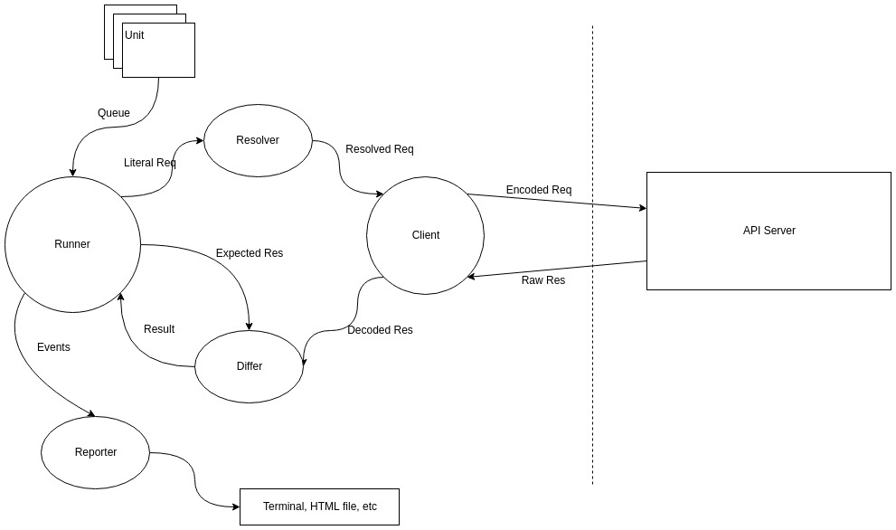

# HTTE - 文档驱动的接口测试框架

[](https://www.npmjs.com/package/htte)
[](https://travis-ci.org/sigoden/htte)
[](https://www.codacy.com/app/sigoden/htte?utm_source=github.com&amp;utm_medium=referral&amp;utm_content=sigoden/htte&amp;utm_campaign=Badge_Grade)
[](https://david-dm.org/sigoden/htte)
[](https://snyk.io/test/github/sigoden/htte?targetFile=package.json)

为什么接口需要测试？

- 提高服务质量，减少 Bug
- 更早定位 Bug，节省调试和处理时间
- 更容易进行代码变更和重构
- 测试也是文档，有助于熟悉服务功能和逻辑
- 服务验收标准

有许多项目却没有接口测试，因为测试难，难在：

- 编写测试让工作量翻倍
- 编写测试代码需要一定的学习成本
- 接口间数据耦合使测试不容易编写
- 构造请求数据和校验响应数据本身就很枯燥繁琐
- 测试代码也是代码，不花精力优化迭代也会腐化

有没有一条策略，既能让我们享受到测试带来的益处，又能最大程度的降低其成本呢？

测试一个功能，无非是给它一定输入，然后看它输出对不对。测试最难的地方大概不在于测试的概念、方法、思路上，而在其工作(代码)量上。

既然用代码来承载并执行接口测试存在诸多问题，有没有更好的方式呢？

有，那就是文档。

HTTE 中，文档就是测试。

## 初体验+入门

- 安装命令行
```
npm i htte-cli -g
```

- 编写配置文件 `htte.yaml`

```yaml
modules:
- auth
```

- 编写测试文档文件 `modules/auth.yaml`

```yaml
- describe: john登录
  name: loginJohn
  req:
    url: https://htte-realworld.herokuapp.com/api/users/login
    method: post
    body:
      user:
        email: john@jacob.com
        password: johnnyjacob
  res:
    body:
      user:
        email: john@jacob.com
        username: johnjacob
        token: !@exist
- describe: john更改用户名
  includes: updateUser
  req:
    headers:
      Authorization: !$concat ['Bearer', ' ', !$query loginJohn.res.body.user.token]
    body:
      user:
        username: johnjacobII
  res:
    body: !@object
      username: johnjacobII
```

- 执行测试
```
htte htte.yaml
```

## 文档驱动优点

### 更容易读

有这样一个接口：它的服务地址是 `http://localhost:3000/add`，采用 `POST` 并使用 `json` 作为数据交换格式，请求数据格式 `{ a: number, b: number}`，返回数据格式 `{c: number}`，实现功能是对 `a`，`b` 求和并返回结果 `c`。

针对这个接口，测试思路： 向这个接口传递数据 `{"a":3,"b":4}`，并期待它返回`{"c":7}`

这个测试以文档的形式在 HTTE 中是这样写的。

```yaml
- describe: 两个数相加
  req:
    url: http://localhost:3000/add
    method: post
    headers:
      Content-Type: application/json
    body:
      a: 3
      b: 4
  res:
    body:
      c: 7
```
直接罗列请求和响应，再加一段描述说明测试是干什么的，一个完整的测试就编写完成了。

### 更容易读

请看下面两个测试，猜猜目标接口实现了什么功能。

```yaml
- describe: 登录
  name: fooLogin
  req:
    url: /login
    method: post
    body:
      email: foo@example.com
      password: '123456'
  res:
    body:
      token: !@exist string
- describe: 更改昵称
  req:
    url: /user
    method: put
      Authorization: !$conat [Bearer, ' ', !$query fooLogin.res.body.token]
    body:
      nickname: bar
  res:
    body:
      msg: ok
```

尽管你现在可能还不理解 `!@exist`, `!$concat`, `!$query`，但应该能粗略明白这两个接口的功能、请求响应数据格式。

由于测试逻辑由文档承载，HTTE 轻而易举获得一些其它框架梦寐以求的优点：

### 编程语言无关性

完全不需要 care 后端是那种语言实现的，再也不担心从一门语言切换到另一门语言，更遑论从一个框架切换到另一个框架了。

### 技能要求低，上手快

纯文档，不需要懂后端的技术栈，甚至不需要会编程。小白员工，甚至是文职都能快速掌握并编写。

### 效率高，开发快

容易写，又容易读，技能要求又低，当然写起来快了。终于能自由的享用测试带来的优点，又最大的避免测试带来的麻烦。

### 天然适合测试驱动开发

文档写起来又快又容易，很方便采用 TDD 开发策略。终于可以无副作用享受 TDD 的优点了。

### 作为前端接口使用说明

即使有 swagger/blueprint 文档了但还是不会用接口怎么办？把测试文档扔给他，满满的都是例子。

### 作为后端需求文档/开发指导文件

初入职员工或初级工程师可能没有那么熟悉业务，技能也没有那么熟练，需要较长的学习期或适应期，写出的接口质量可能也不过关。
有这样一份测试文档能大大缩短这段时间，提高接口质量。

## HTTE 优点

HTTE 除了拥有文档驱动测试的全部优点外，还拥有以下优点.

### 使用 YAML 语言

不是引入新的 DSL，而是直接采用 YAML。没有额外的学习成本，也更容易上手，还能能享受现有 YAML 工具和生态。

### 使用插件灵活生成请求校验响应

先说说为什么文档驱动的测试中需要插件。

某个接口有重名检测，所以测试时我们需要生成一个随机字符串，如何在文档描述随机数呢？某个接口返回一个过期时间，我们需要校验这个时间是再当前时间 24 小时之后，如何再文档中定义这个时间呢？ 

文档驱动测试这一策略最大的阻碍就是文档无法承载复杂逻辑，缺乏灵活性，它很难描述随机字符串，当前时间这些概率。只有函数才能提供这种灵活性。
插件就是为文档提供函数的，提供这种灵活性的。

插件以 YAML 自定义标签的形式呈现。

有这样一段代码

```yaml
req:
  body: !$concat [a, b, c]
res:
  body: !@regexp \w{3}
```
`!$concat` 和 `!@regexp` 就是 YAML 标签，它是一种用户自定义的数据类型。再 HTTE 中，其实就是函数。
所以上面的代码再 HTTE 看来是这样子的。

```js
{
  req: {
    body: function(ctx) {
      return (function(literal) {
          return literal.join('');
      })(['a', 'b', 'c'])
    }
  }
  res: {
    body: function(ctx, actual) {
      (function(literal) {
          let re = new Regexp(literal);
          if (!re.test(actual)) {
              ctx.throw('不匹配正则')
          }
      })('\w{3}')
    }
  }
}
```

总的来说，文档具有易读易写易上手等优点，但无法承载复杂逻辑，不够灵活；而函数/代码能提供这种灵活性，但又带来过多的复杂性。
HTTE 采用 YAML格式，将函数封装到 YAML 标签中， 协调了这种矛盾，最大程度融合彼此的优点，并几乎规避的彼此的缺点。
这是 HTTE 最大的创新之处了。

接口测试中关于数据主要有两种操作，构造请求和校验响应。所以 HTTE 中存在两种插件。

- 构造器(resolver)，用来构造数据，标签前缀 `!$`
- 比对器(differ)，用来比对校验数据，标签前缀 `!@`

插件集:

- [builtin](packages/htte-plugin-builtin)

### 组件化，易扩展

HTTE 架构图如下:



每个组件都是一个独立的模块，对立完成一项具体的工作。所以能很轻易的替换，也很容易进行扩展。

下面结合一个例子，介绍一个测试单元在 HTTE 中具体执行过程，以便大家熟悉各个组件的功能。

又这样一个测试

```yaml
- describe:
  req:
    body:
      v: !$randnum [3, 6]
  res:
    body:
      v:  !@compare
        op: gt
        value: 2
```

在被 `Runner` 载入后所有 YAML 标签依据插件定义展开成函数，伪代码如下。与此同时 `Runner` 会发送 `runUnit` 事件。

```js
{
  req: { // Literal Req
    body: {
      v: function(ctx) {
        return (function(literal) {
          let [min, max] = literal
          return Math.random() * (max - min) + min;
        })([3, 6])
      }
    }
  },
  res: { // Expect Res
    body: {
      v: function(ctx, actual) {
        (function(literal) {
          let { op, value } = literal
          if (op === 'gt') fn = (v1, v2) => v1 > v2;
          if (fn(actual, literal)) return;
          ctx.throw('test fail');
        })({op: 'gt', value: 2})
      }
    }
  }
}
```

`Runner` 将 `Literal Req` 传递给 `Resolver`，`Resolver` 的工作就是递归遍历 `Req` 中的函数并执行，得到一个纯值的数据。并传递给 `Client`。

```js
req: { // Resolved Req
  body: {
    v: 5
  }
}
```
`Client` 收到这个数据后，构造请求，并将数据编码为合适的格式(如果是`JSON`，`Encoded Req` 将变成 `{"v":5}`)，并发送给后端接口服务。
`Client` 收到后端服务返回的响应后，需要先将数据解码。假设这个接口是一个回显服务，返回的数据是`{"v":5}`(`Raw Res`)且为`JSON`，`Client` 会将数据解码为：

```js
res: { // Decoded Res
  body: {
    v: 5
  }
}
```
`Differ` 这时将拿到来自 `Runner` 的 `Expected Res` 和 来自 `Client` 的 `Decoded Res`。它的工作就是将两者进行比对。

`Differ` 会遍历 `Expected Res` 中的每一个值，逐一于 `Decoded Res` 进行比对。有任意一处不相等都会抛出错误，标记测试失败。
如果两者都是值，判断是否它们全等。如果碰到函数，那么会执行比对函数。伪代码如下：

```js
(function(ctx, actual) {
    (function(literal) {
      let { op, value } = literal
      if (op === 'gt') fn = (v1, v2) => v1 > v2;
      if (fn(actual, literal)) return;
      ctx.throw('test fail');
    })({op: 'gt', value: 2})
  }
})(ctx, 5)
```

如果比对函数没有抛出错误，表示测试通过。`Runner` 收到测试通过的结果后将发送 `doneUnit` 事件，并执行队列中的下一条测试。

`Reporter` 监听 `Runner` 发送的事件，生成相应的报告，或打印到终端，或生成 HTML 报告文件。

### 接口协议可扩展，目前已支持 HTTP/GRPC

接口协议由客户端扩展提供。

- [htte](packages/htte-client-http) - 适用于 HTTP 接口测试
- [grpc](packages/htte-client-grpc) - 适用于 GRPC 接口测试

### 报告生成器可扩展，目前已支持 CLI/HTML

- [cli](packages/htte-reporter-cli) - 输出到命令行
- [html](packages/htte-reporter-html) - 以 HTML 文件的形式输出测试报告

### 优雅解决的接口数据耦合

接口间数据是存在耦合的。常见例子，先登录拿到 TOKEN 之后才有权限下订单，发朋友圈等。

所以一个接口测试常常需要访问另一个测试的数据。

HTTE 通过会话 + 插件处理这个问题。

还是结合例子来说明。

有一个登录接口，是这样的。
```yaml
- describe: tom login
  name: tomLogin # <--- 为测试注册一个名字， Why? 
  req:
    body:
      email: tom@gmail.com
      password: tom...
  res:
    body:
      token: !@exist string
```

有一个修改用户名的接口，它是权限接口，必须有个 `Authorization` 请求头且带上登录返回的 `token` 才能使用。
```yaml
- describe: tom update username to tem
  req:
    headers:
      Authorization: !$conat [Bearer, ' ', token?] # <--- 如何当上 TOKEN 呢？
    body:
      username: tem
```
揭晓答案
```yaml
      Authorization: !$conat [Bearer, ' ', !$query tomLogin.res.body.token]
```

还可以通过 `tomLogin.req.body.email` 获取邮箱值，通过 `tomLogin.req.body.password` 获取密码。是不是优雅？

这是如何实现的呢？

HTTE 中 `Runner` 启动后，会初始化会话。每次执行完一条单元测试后，会将执行结果记录在会话中，包括请求数据，响应数据，耗费时间，测试结果等。这些数据是只读的，并作为`ctx`的暴露给了插件函数，所以插件能访问于它之前执行的测试的数据。

同一个测试中, `res` 中也是能引用 `req` 中的数据的。

```yaml
- describe: res ref data in req
  req:
    body: !$randstr
  res:
    body: !@query req.body
```

### 使用宏减少重复书写

围绕一个接口常常会由复数个单元测试，而接口有一些一致的属性，拿 HTTP 接口举例，有 `req.url`, `req.method`, `req.type`，难道每次调用都要重新写一遍吗？

```yaml
- decribe: add api condition 1
  req:
    url: /add
    method: put
    type: json
    body: v1...
- decribe: add api condition 2
  req:
    url: /add
    method: put
    type: json
    body: v2...
```
宏就是为了解决这种重复输入问题而引入的。使用也很简单，定义+引用。

在项目配置中定义宏。

```yaml
defines:
  add: # <-- 定义宏
    req:
      url: /add
      method: put
      type: json
```

任意地方再用到这个接口，只需要这样了

```yaml
- describe: add api with macro
  includes: add # <-- 引用宏
  req:
    body: v...
```

### 边调试边开发

这个特性是通过组合命令行选项实现。
相关的两个命令行选项是: `--bail` 遇到任何测试失败的情况停止执行；`--continue` 从上次中断的地方继续执行测试。

组合这两个选项，可以让我们无数次重置执行该问题接口，直到调试通过。

## 项目配置

```yaml
modules:                     # 指定测试文件列表。列表顺序对应执行顺序。HTTE 将以配置文件所在目录下的 `modules` 目录为当前目录查找并对应模块文件。
- m1                           # 省略后缀，推荐
- m2.yaml                      # 后缀为 `yaml`
- m3.yml                       # 后缀为 `yml`
- sub1/m                       # 子目录
- ../sub1/m                    # 其它目录
- /home/xxx/proj/m             # 绝对路径
session:                     # 指定持久化会话文件存储位置，一般情况下不用填写，HTTE 会在操作系统暂存文件夹下生成一个项目唯一的临时文件存储会话
clients:                     # 配置可用客户端。省略将采用默认配置，即 {name: 'http', pkg: 'htte-client-http', options: {}}
- name: http                   # 服务名
  pkg: htte-client-http        # 包名
  options:                     # 客户端扩展选项，由客户端提供，请查阅客户端文档填写。
plugins:                     # 配置安装的插件集。省略将采用默认配置，即 {pkg: 'htte-plugin-builtin', options: {}}
- name: ns                     # 插件名称空间，插件标签名要用到 如'!@ns/name'
  pkg: htte-plugin-builtin     # 包名
  options:                   # 配置插件集选项，由插件集提供，请查阅插件集文档填写。
reporters:                   # 配置启用的报告生成器。省略采用默认配置，即 {pkg: 'htte-reporter-cli', options: {}}
- name: cli                    # 报告生成器
  pkg: htte-reporter-cli       # 包名
  options:                     # 报告生成器扩展选项，由报告生成器提供，请查阅报告生成器文档填写。
defines:                     # 定义宏
  <name>:                      # 宏名
    client:                    # 接口客户端/协议
    req:                       # 
    res:
```

### 配置补丁

配置补丁用来应对环境差异下的配置变更。比如测试环境写，接口地址为 `http://localhost:3000/api`；正式环境下需要变更为 `https://example.com/api`。最好后配置补丁实现。  

定义补丁文件,补丁文件命名规则 <base>.<patch>.<ext>。如果项目配置文件名 `htte.yaml`，补丁名 `prod`，则补丁文件名为 `htte.prod.yaml`。
```yaml
- op: replace
  path: /clients/0/options/baseUrl
  value: https://example.com/api
```

命令行中使用 `--patch` 选项选定补丁文件。例如我们要引用 `htte.prod.yaml`，输入 `--patch prod`

补丁文件规范 [jsonpatch.com](http://jsonpatch.com/)。

## 测试单元/组

测试单元是 HTTE 的基本单位。其选项如下。

```yaml
- describe: unit   # 定义一个测试单元
  name: u1         # 测试名，方便 `!$query` 和 `!@query` 引用
  client: http     # 指定使用的客户端
  includes: api    # 引用宏，可以接数组引用多个宏
  metadata:        # 元标签，HTTE 引擎专用数据
    skip: true     # 跳过这条测试
    debug: true    # 报告时打印的请求和响应数据详情
    stop: true     # 执行该条测试后终止后续操作
  req:             # 请求，查阅对应客户端扩展的文档填写
  res:             # 响应，查阅对应客户端扩展的文档填写
```

有时一项功能测试需要多个测试单元配合才能完成。为了表示这种组合关系，HTTE 引入了组的概念。

```yaml
- describe: group  # 定义一个测试组
  defines:         # 定义一个宏，与配置文件一致，不过作用域仅限组内
  units:           # 子元素 
  - describe: t1     # 组嵌套组
    units: []     
  - describe: t2     # 测试单元
    req:
```